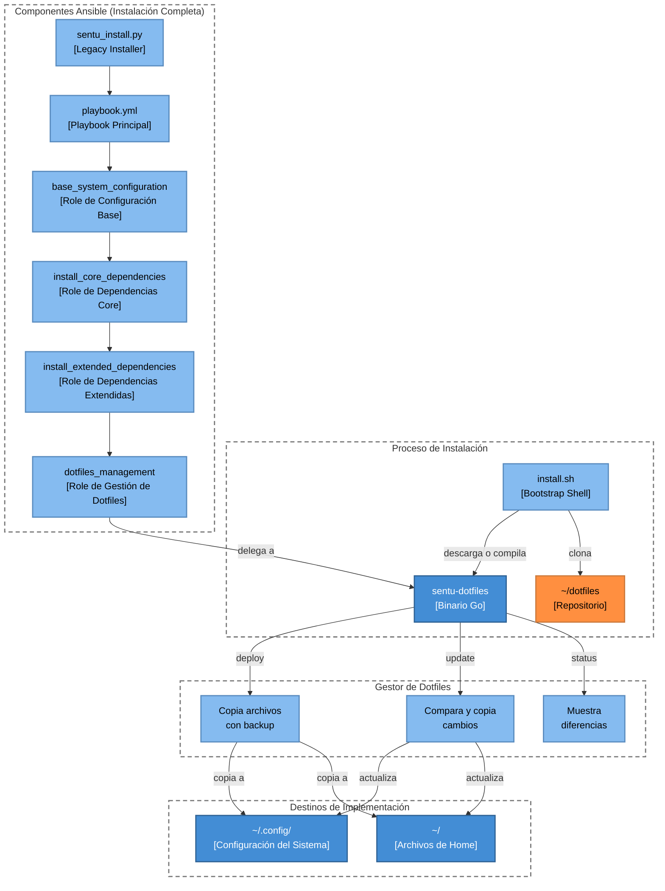

```
  █▀ █▀▀ █▄░█ ▀█▀ █░█  ┎┤  Ingeniería de Datos & Data Science  ├┒
  ▄█ ██▄ █░▀█ ░█░ █▄█  ┖┤         Dotfiles Manager Go          ├┚
              .studio
```

<div align="center"><p>
    <a href="https://github.com/SENTUstudio/dotfiles/releases/latest">
      
    </a>
    <a href="https://github.com/SENTUstudio/dotfiles/pulse">
      
    </a>
    <a href="https://github.com/SENTUstudio/dotfiles/blob/main/LICENSE">
      
    </a>
    <a href="https://github.com/SENTUstudio/dotfiles/stargazers">
      
    </a>
    <a href="https://github.com/SENTUstudio/dotfiles/issues">
      
    </a>
    <a href="https://github.com/SENTUstudio/dotfiles">
      
    </a>
  </p>
</div>

# SENTU Dotfiles — Automated Linux & macOS Development Environment

> **One-command post-installation framework** for Fedora, Arch Linux, Debian, Ubuntu & macOS.
> Powered by a standalone Go binary for dotfile management + Ansible for system provisioning.
> Installs 100+ packages: Neovim, Tmux, Docker, Zsh, Homebrew, Kitty, Lazygit, and more.

**SENTU Dotfiles** automatiza la post-instalación de tu sistema operativo. Ejecutás un solo comando (`curl | bash`), se descarga el bootstrap `install.sh` que instala `sentu-dotfiles` (binario Go standalone) y te presenta una **TUI interactiva** para gestionar tus dotfiles y sistema.

- 🖥️ **Multi-sistema**: Fedora, Archlinux, Debian/Ubuntu, macOS (Apple Silicon & Intel)
- 📦 **100+ aplicaciones**: Desde herramientas CLI hasta apps GUI via Flatpak/Homebrew
- 🎯 **TUI Interactiva**: Gestión de dotfiles con Bubble Tea (navegación con teclado)
- ⚡ **Ansible-powered**: Instalación declarativa, idempotente y reproducible
- 🔧 **sentu-dotfiles**: Binario Go standalone para deploy/update/status/backup de configs
- 💾 **Copia segura**: Archivos reales en `~/.config/` (no symlinks), con backup automático

## Tabla de Contenidos

- [Características Principales](#características-principales)
- [Sistemas Operativos Soportados](#sistemas-operativos-soportados)
- [Instalación Rápida](#instalación-rápida)
- [Menú Interactivo](#menú-interactivo)
- [Modo Solo Dotfiles](#modo-solo-dotfiles)
- [Aplicaciones Incluidas](#aplicaciones-incluidas)
- [Estructura del Proyecto](#estructura-del-proyecto)
- [Diagrama de Flujo](#diagrama-de-flujo)
- [Documentación](#documentación)
- [Contribuir](#contribuir)
- [Licencia](#licencia)

---

## Características Principales

| Característica | Descripción |
|----------------|-------------|
| **One-command setup** | `curl \| bash` y listo |
| **Multi-distro** | Fedora, Arch, Debian, Ubuntu, macOS |
| **sentu-dotfiles** | Binario Go standalone: deploy/update/status/add/backup |
| **TUI Interactiva** | Bubble Tea con navegación vim-keys |
| **Ansible-powered** | Configuración declarativa y reproducible |
| **100+ paquetes** | Dev tools, terminales, multimedia, etc. |
| **Modo dry-run** | `--check` para simular sin modificar |
| **Solo dotfiles** | Sincronizá configs sin instalar nada |
| **Backup automático** | Timestamped backups antes de cualquier cambio |

---

## Sistemas Operativos Soportados

| Sistema | Versión | Estado | Gestor de Paquetes |
|---------|---------|--------|-------------------|
| **Fedora KDE** | 41+ | ✅ Probado | `dnf` |
| **Arch Linux** | Rolling | ✅ Probado | `pacman` + `yay` |
| **Debian** | 12+ | ⚠️ Parcial | `apt-get` |
| **Ubuntu** | 22.04+ | ⚠️ Parcial | `apt-get` |
| **macOS** | 13+ (Apple Silicon & Intel) | 🔄 Beta | `homebrew` |
| **OpenSUSE** | — | 📝 Roadmap | `zypper` |

---

## Estructura del Proyecto

```bash
dotfiles/
├── cmd/sentu-dotfiles/           # Entry point del binario Go
│   └── main.go                   # CLI (Cobra) + TUI (Bubble Tea)
├── internal/
│   ├── config/config.go          # Configuración de rutas y mapeos
│   ├── dotfiles/engine.go        # Core engine: deploy/update/add/status/backup
│   └── tui/                      # TUI con Bubble Tea
│       ├── model.go              # Modelo de la interfaz interactiva
│       └── styles.go             # Estilos Lipgloss
├── ansible/
│   ├── playbook.yml              # Playbook principal
│   ├── playbook-test.yml         # Playbook de test
│   ├── roles/                    # Roles de Ansible (15+)
│   │   ├── 00_load_vars/
│   │   ├── 01_base_system_configuration/
│   │   ├── 02_add_repositories/
│   │   ├── 03_install_core_dependencies/
│   │   ├── 04_install_uv/
│   │   ├── 05_install_nvm/
│   │   ├── 06_install_lazygit/
│   │   ├── 07_install_extended_dependencies/
│   │   ├── 08_install_docker/
│   │   ├── 09_post_install/
│   │   ├── 10_config_zsh/
│   │   ├── 11_install_flatpak/
│   │   ├── 12_install_fonts/
│   │   └── 14_dotfiles_management/   # Delega a sentu-dotfiles deploy
│   └── vars/                     # Variables por distro
│       ├── RedHat.yaml           # Fedora
│       ├── Archlinux.yaml
│       ├── Debian.yaml
│       ├── Darwin.yaml           # macOS
│       └── post_install.yaml
├── config/                       # Dotfiles (~/.config/)
│   ├── alacritty, bspwm, fastfetch
│   ├── gh, git, kitty, lazygit
│   ├── mpd, ncmpcpp, nvim
│   ├── ohmyposh, opencode        # ← Config de OpenCode
│   ├── ranger, sentu, tmux
│   ├── tmuxinator, zsh
│   └── ...
├── docs/
│   ├── aplicaciones.md           # Inventario completo de apps
│   ├── analisis-zshrc.md
│   └── badges/
├── home/                         # Archivos de home (~)
│   ├── .p10k.zsh
│   ├── .zshrc
│   └── .zshrc.secrets.template   # Template para credenciales
├── tests/
│   └── tart/                     # Scripts de testing con Tart VMs
│       ├── setup-macos-base.sh
│       ├── run-macos-test.sh
│       └── ...
├── .github/workflows/
│   └── release.yml               # CI/CD: compila releases cross-platform
├── install.sh                    # Bootstrap principal (descarga binario o compila)
├── sentu_install.py              # Instalador legacy (Ansible + picker)
├── go.mod / go.sum               # Módulo Go
└── README.md
```

# Instalación Rápida

```bash
curl -fsSL https://raw.githubusercontent.com/SENTUstudio/dotfiles/main/install.sh | bash
```

> **Nota:** El script `install.sh` detecta tu plataforma, descarga el binario precompilado desde GitHub Releases (o compila desde source si no hay release), clona el repo de dotfiles y ejecuta `sentu-dotfiles`.

## sentu-dotfiles — Gestor de Dotfiles

`sentu-dotfiles` es un binario Go standalone para gestionar tus configuraciones:

```bash
# Interactivo (TUI)
sentu-dotfiles

# Comandos directos
sentu-dotfiles deploy              # Instalar dotfiles por primera vez
sentu-dotfiles update              # Actualizar después de git pull
sentu-dotfiles status              # Ver diferencias repo vs sistema
sentu-dotfiles add ~/.config/nvim  # Agregar nueva config al repo
sentu-dotfiles backup              # Backup manual de configs actuales
```

### TUI Interactiva

Ejecutando `sentu-dotfiles` sin argumentos lanza la interfaz interactiva:

```
  █▀ █▀▀ █▄░█ ▀█▀ █░█  ┎┤ Ingeniería de Datos & Data Science ├┒
  ▄█ ██▄ █░▀█ ░█░ █▄█  ┖┤  Dotfiles Manager                  ├┚
                .studio

Seleccioná una opción:

  🚀 Deploy     Instalar dotfiles por primera vez
  🔄 Update     Actualizar dotfiles (solo cambios)
  📊 Status     Ver diferencias entre repo y sistema
  ➕ Add        Agregar una config del sistema al repo
  💾 Backup     Backup manual de configs actuales
  ❌ Salir

↑/k ↓/j navegar • enter seleccionar • q salir
```

## Instalación Completa (Ansible)

Para instalar el sistema completo (paquetes, fonts, docker, etc.) usá el instalador legacy:

```bash
curl -LsSf https://raw.githubusercontent.com/SENTUstudio/dotfiles/refs/heads/main/sentu_install.py | python3
```

> **Nota:** Requiere **Python 3.9+**. En macOS 13-14 se instala Python 3 automáticamente si falta.

### Opciones del Instalador Legacy

| Opción | Descripción | Cuándo usarla |
|--------|-------------|---------------|
| **`[1] Instalación completa`** | Instala todo: dependencias del sistema, apps extendidas, y copia los dotfiles | **Sistema operativo recién instalado** |
| **`[2] Solo dotfiles`** | Delega a `sentu-dotfiles deploy` | **Sistema ya configurado**, solo querés sincronizar configs |
| **`[3] Modo test`** | Simula la instalación sin modificar nada (usa `--check` de Ansible) | **Querés ver qué haría** sin tocar el sistema |
| **`[4] Salir`** | Cancela la instalación | — |
| **`[5] Instalación personalizada`** | Seleccionás categorías y apps individuales via TUI | **Querés elegir exactamente qué instalar** |

---

## Opción [2] Solo Dotfiles

La opción **"Solo dotfiles"** es ideal cuando:
- ✅ Ya tenés tu sistema configurado con los paquetes que necesitás
- ✅ Solo querés sincronizar tus archivos de configuración
- ✅ Estás en una máquina que no querés modificar mucho

**Qué hace:**
- ❌ **No instala** paquetes del sistema (dnf/apt/pacman/brew)
- ❌ **No instala** apps extendidas (neovim, kitty, docker, etc.)
- ✅ **Copia archivos reales** (no symlinks) de `config/` → `~/.config/` y `home/` → `~/`
- ✅ **Hace backup automático** de configuraciones existentes antes de sobrescribir

**Ejemplo de uso:**
```bash
# Vía install.sh (recomendado)
curl -fsSL https://raw.githubusercontent.com/SENTUstudio/dotfiles/main/install.sh | bash

# O directamente con sentu-dotfiles (si ya tenés el binario)
sentu-dotfiles deploy
```

---

## Aplicaciones Incluidas

El proyecto instala automáticamente más de **100 aplicaciones y herramientas** organizadas por categoría:

### Desarrollo y Productividad
- **Editores**: Neovim, VS Code (opcional)
- **Terminales**: Kitty, Alacritty, Ghostty, Tmux
- **Herramientas CLI**: ripgrep, fd, bat, fzf, zoxide, lazygit, atuin
- **Runtimes**: Python 3, Go, Rust, Node.js (nvm), Lua
- **Contenedores**: Docker, Docker Compose

### Sistema y Monitoreo
- **Fetch**: fastfetch, neofetch
- **Monitoreo**: btop, htop
- **Utilidades**: lsd, tree, unzip, p7zip

### Multimedia
- **Reproductores**: VLC, MPV, Audacity
- **Editores**: Kdenlive, LMMS, GIMP, Inkscape
- **Codecs**: FFmpeg

### Comunicación
- Discord, Telegram

### Fuentes y Temas
- Nerd Fonts (FiraCode, JetBrains Mono)
- Powerlevel10k (prompt Zsh)

📋 **Ver inventario completo** → [`docs/aplicaciones.md`](docs/aplicaciones.md)

---

## sentu-dotfiles CLI

El binario `sentu-dotfiles` gestiona tus configuraciones de forma standalone:

### Comandos

| Comando | Descripción | Ejemplo |
|---------|-------------|---------|
| `deploy` | Copia todos los dotfiles del repo al sistema con backup | `sentu-dotfiles deploy` |
| `update` | Re-deploy inteligente: solo copia lo que cambió | `sentu-dotfiles update` |
| `status` | Muestra diferencias entre repo y sistema | `sentu-dotfiles status` |
| `add <path>` | Agrega una config del sistema al repo | `sentu-dotfiles add ~/.config/nvim` |
| `backup` | Backup manual de todas las configs actuales | `sentu-dotfiles backup` |

### Flujo de trabajo diario

```bash
# 1. Hacés cambios en el repo
cd ~/dotfiles
# Editás config/nvim/init.lua

# 2. Commiteás y pusheás
git add config/nvim/init.lua
git commit -m "update nvim config"
git push

# 3. En otra máquina, actualizás
cd ~/dotfiles && git pull
sentu-dotfiles update
```

### Por qué copia en lugar de symlinks

Algunos programas (como **opencode**) gestionan sus archivos y plugins directamente en los directorios de configuración y fallan cuando estos son symlinks. `sentu-dotfiles` usa **copia de archivos reales** para garantizar compatibilidad 100%.

| Método | Actualización | Edición | Compatibilidad |
|--------|--------------|---------|----------------|
| **Symlinks** (anterior) | `git pull` actualiza todo | Editás en `~/.config/` = editás el repo | Algunos programas rompen |
| **Copia** (actual) | `sentu-dotfiles update` | Editás en el repo, luego `update` | 100% compatible |

---

## Documentación

| Documento | Descripción |
|-----------|-------------|
| [`docs/aplicaciones.md`](docs/aplicaciones.md) | Inventario completo de 100+ apps con matriz de compatibilidad |
| [`docs/analisis-zshrc.md`](docs/analisis-zshrc.md) | Análisis detallado de la configuración Zsh |
| [`docs/SEO_STRATEGY.md`](docs/SEO_STRATEGY.md) | Estrategia de SEO y descubrimiento del proyecto |
| [`tests/tart/README.md`](tests/tart/README.md) | Guía de testing con máquinas virtuales Tart |

---

# Diagrama de flujo


```mermaid
flowchart TD
    %% Define styles for C4-like appearance
    classDef person fill:#08427B,color:#fff,stroke:#052E56,stroke-width:2px
    classDef externalSystem fill:#999999,stroke:#666666,stroke-width:2px
    classDef container fill:#438DD5,color:#fff,stroke:#2E6295,stroke-width:2px
    classDef component fill:#85BBF0,color:#000,stroke:#5A8CBF,stroke-width:2px
    classDef database fill:#FF8F40,color:#000,stroke:#CC7A3C,stroke-width:2px
    classDef boundary fill:none,stroke:#444,stroke-width:2px,stroke-dasharray:5 5

    %% Installation Process with C4 styling
    subgraph boundary_install ["Proceso de Instalación"]
        A["install.sh\n[Bootstrap Shell]"]:::component
        A -->|"descarga o compila"| SD["sentu-dotfiles\n[Binario Go]"]:::container
        A -->|"clona"| REPO["~/dotfiles\n[Repositorio]"]:::database
    end

    %% Dotfiles Manager
    subgraph boundary_dotfiles ["Gestor de Dotfiles"]
        SD -->|"deploy"| SD1["Copia archivos\ncon backup"]:::component
        SD -->|"update"| SD2["Compara y copia\ncambios"]:::component
        SD -->|"status"| SD3["Muestra\ndiferencias"]:::component
    end

    %% Ansible Components with C4 styling
    subgraph boundary_ansible ["Componentes Ansible (Instalación Completa)"]
        B["sentu_install.py\n[Legacy Installer]"]:::component
        B1["playbook.yml\n[Playbook Principal]"]:::component
        B2["base_system_configuration\n[Role de Configuración Base]"]:::component
        B3["install_core_dependencies\n[Role de Dependencias Core]"]:::component
        B4["install_extended_dependencies\n[Role de Dependencias Extendidas]"]:::component
        B5["dotfiles_management\n[Role de Gestión de Dotfiles]"]:::component
    end

    %% Deployment Targets with C4 styling
    subgraph boundary_deploy ["Destinos de Implementación"]
        C["~/.config/\n[Configuración del Sistema]"]:::container
        D["~/\n[Archivos de Home]"]:::container
    end

    %% Flow
    B --> B1
    B1 --> B2
    B2 --> B3
    B3 --> B4
    B4 --> B5
    B5 -->|"delega a"| SD

    SD1 -->|"copia a"| C
    SD1 -->|"copia a"| D
    SD2 -->|"actualiza"| C
    SD2 -->|"actualiza"| D

    %% Set boundary style
    style boundary_install fill:none,stroke:#777,stroke-width:2px,stroke-dasharray:7 5
    style boundary_dotfiles fill:none,stroke:#777,stroke-width:2px,stroke-dasharray:7 5
    style boundary_ansible fill:none,stroke:#777,stroke-width:2px,stroke-dasharray:7 5
    style boundary_deploy fill:none,stroke:#777,stroke-width:2px,stroke-dasharray:7 5

    %% Hyperlinks
    click A "https://github.com/sentustudio/dotfiles/blob/main/install.sh"
    click SD "https://github.com/sentustudio/dotfiles/tree/main/cmd/sentu-dotfiles"
    click B "https://github.com/sentustudio/dotfiles/blob/main/sentu_install.py"
    click B1 "https://github.com/sentustudio/dotfiles/blob/main/ansible/playbook.yml"
    click B2 "https://github.com/sentustudio/dotfiles/tree/main/ansible/roles/base_system_configuration"
    click B3 "https://github.com/sentustudio/dotfiles/tree/main/ansible/roles/install_core_dependencies"
    click B4 "https://github.com/sentustudio/dotfiles/tree/main/ansible/roles/install_extended_dependencies"
    click B5 "https://github.com/sentustudio/dotfiles/tree/main/ansible/roles/dotfiles_management"
    click C "https://github.com/sentustudio/dotfiles/tree/main/config"
    click D "https://github.com/sentustudio/dotfiles/tree/main/home"
```

---

## Contribuir

¡Las contribuciones son bienvenidas! Podés:

- 🐛 **Reportar bugs**: Abrí un [issue](https://github.com/SENTUstudio/dotfiles/issues)
- 💡 **Sugerir features**: Discusiones en [GitHub Discussions](https://github.com/SENTUstudio/dotfiles/discussions)
- 🔧 **Enviar PRs**: Fork → branch → PR a `develop`
- 📖 **Mejorar docs**: README, comentarios, traducciones

### Guía rápida para PRs

1. Fork el repo
2. Creá una branch: `git checkout -b feature/tu-feature`
3. Commiteá con [Conventional Commits](https://www.conventionalcommits.org/)
4. Push y abrí PR a `develop`

---

## Licencia

[MIT License](LICENSE) © 2025 SENTUstudio

---

<div align="center">
  <p>
    <sub>Hecho con ❤️ por <a href="https://github.com/SENTUstudio">SENTUstudio</a></sub>
  </p>
  <p>
    <a href="https://github.com/SENTUstudio/dotfiles">⭐ Star this repo</a> • 
    <a href="https://github.com/SENTUstudio/dotfiles/fork">🍴 Fork</a> • 
    <a href="https://github.com/SENTUstudio/dotfiles/issues">🐛 Report Issue</a>
  </p>
</div>
