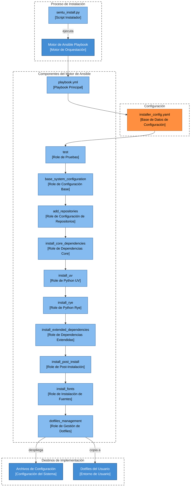

```
  █▀ █▀▀ █▄░█ ▀█▀ █░█  ┎┤  Ingeniería de Datos & Data Science  ├┒
  ▄█ ██▄ █░▀█ ░█░ █▄█  ┖┤              en Python               ├┚
              .studio
```

<div align="center"><p>
    <a href="https://github.com/SENTUstudio/dotfiles/releases/latest">
      
    </a>
    <a href="https://github.com/SENTUstudio/dotfiles/pulse">
      
    </a>
    <a href="https://github.com/SENTUstudio/dotfiles/blob/main/LICENSE">
      
    </a>
    <a href="https://github.com/SENTUstudio/dotfiles/stargazers">
      
    </a>
    <a href="https://github.com/SENTUstudio/dotfiles/issues">
      
    </a>
    <a href="https://github.com/SENTUstudio/dotfiles">
      
    </a>
  </p>
</div>

# SENTU Dotfiles — Automated Linux & macOS Development Environment

> **One-command post-installation framework** for Fedora, Arch Linux, Debian, Ubuntu & macOS. 
> Interactive TUI picker to select apps by category. Installs 100+ packages via Ansible: 
> Neovim, Tmux, Docker, Zsh, Homebrew, Kitty, Lazygit, and more.

**SENTU Dotfiles** automatiza la post-instalación de tu sistema operativo. Ejecutás un solo comando (`curl | python3`), se descarga el instalador `sentu_install.py` y te presenta un **menú interactivo** para elegir exactamente qué querés instalar.

- 🖥️ **Multi-sistema**: Fedora, Archlinux, Debian/Ubuntu, macOS (Apple Silicon & Intel)
- 📦 **100+ aplicaciones**: Desde herramientas CLI hasta apps GUI via Flatpak/Homebrew
- 🎯 **TUI Picker**: Seleccioná categorías y apps individuales con interfaz interactiva
- ⚡ **Ansible-powered**: Instalación declarativa, idempotente y reproducible
- 🔧 **Modo solo-dotfiles**: Sincronizá solo tus configs sin tocar paquetes del sistema

## Tabla de Contenidos

- [Características Principales](#características-principales)
- [Sistemas Operativos Soportados](#sistemas-operativos-soportados)
- [Instalación Rápida](#instalación-rápida)
- [Menú Interactivo](#menú-interactivo)
- [Modo Solo Dotfiles](#modo-solo-dotfiles)
- [Aplicaciones Incluidas](#aplicaciones-incluidas)
- [Estructura del Proyecto](#estructura-del-proyecto)
- [Diagrama de Flujo](#diagrama-de-flujo)
- [Documentación](#documentación)
- [Contribuir](#contribuir)
- [Licencia](#licencia)

---

## Características Principales

| Característica | Descripción |
|----------------|-------------|
| **One-command setup** | `curl \| python3` y listo |
| **Multi-distro** | Fedora, Arch, Debian, Ubuntu, macOS |
| **TUI Picker** | Selección interactiva por categorías |
| **Ansible-powered** | Configuración declarativa y reproducible |
| **100+ paquetes** | Dev tools, terminales, multimedia, etc. |
| **Modo dry-run** | `--check` para simular sin modificar |
| **Solo dotfiles** | Sincronizá configs sin instalar nada |

---

## Sistemas Operativos Soportados

| Sistema | Versión | Estado | Gestor de Paquetes |
|---------|---------|--------|-------------------|
| **Fedora KDE** | 41+ | ✅ Probado | `dnf` |
| **Arch Linux** | Rolling | ✅ Probado | `pacman` + `yay` |
| **Debian** | 12+ | ⚠️ Parcial | `apt-get` |
| **Ubuntu** | 22.04+ | ⚠️ Parcial | `apt-get` |
| **macOS** | 13+ (Apple Silicon & Intel) | 🔄 Beta | `homebrew` |
| **OpenSUSE** | — | 📝 Roadmap | `zypper` |

---

## Estructura del Proyecto

```bash
dotfiles/
├── ansible/
│   ├── playbook.yml              # Playbook principal
│   ├── playbook-test.yml         # Playbook de test
│   ├── roles/                    # Roles de Ansible (15+)
│   │   ├── 00_load_vars/
│   │   ├── 01_base_system_configuration/
│   │   ├── 02_add_repositories/
│   │   ├── 03_install_core_dependencies/
│   │   ├── 04_install_uv/
│   │   ├── 05_install_nvm/
│   │   ├── 06_install_lazygit/
│   │   ├── 07_install_extended_dependencies/
│   │   ├── 08_install_docker/
│   │   ├── 09_post_install/
│   │   ├── 10_config_zsh/
│   │   ├── 11_install_flatpak/
│   │   ├── 12_install_fonts/
│   │   └── 14_dotfiles_management/
│   └── vars/                     # Variables por distro
│       ├── RedHat.yaml           # Fedora
│       ├── Archlinux.yaml
│       ├── Debian.yaml
│       ├── Darwin.yaml           # macOS
│       └── post_install.yaml
├── config/                       # Dotfiles (~/.config/)
│   ├── alacritty, bspwm, fastfetch
│   ├── gh, git, kitty, lazygit
│   ├── mpd, ncmpcpp, nvim
│   ├── ohmyposh, opencode        # ← Config de OpenCode
│   ├── ranger, sentu, tmux
│   ├── tmuxinator, zsh
│   └── ...
├── docs/
│   ├── aplicaciones.md           # Inventario completo de apps
│   ├── analisis-zshrc.md
│   └── badges/
├── home/                         # Archivos de home (~)
│   ├── .p10k.zsh
│   ├── .zshrc
│   └── .zshrc.secrets.template   # Template para credenciales
├── tests/
│   └── tart/                     # Scripts de testing con Tart VMs
│       ├── setup-macos-base.sh
│       ├── run-macos-test.sh
│       └── ...
├── sentu_install.py              # Bootstrapper principal
└── README.md
```

# Instalación Rápida

```bash
curl -LsSf https://raw.githubusercontent.com/SENTUstudio/dotfiles/refs/heads/main/sentu_install.py | python3
```

> **Nota:** Requiere **Python 3.9+**. En macOS 13-14 se instala Python 3 automáticamente si falta.

## Menú Interactivo

Al ejecutar el instalador, verás este menú:

```
==================================================
  SENTU Dotfiles Installer
==================================================

Selecciona una opción:
  [1] Instalación completa (sistema + dotfiles)
  [2] Solo dotfiles (copiar configs, saltar paquetes)
  [3] Modo test (ansible --check)
  [4] Salir
  [5] Instalación personalizada (elegir apps)
```

### Opciones Disponibles

| Opción | Descripción | Cuándo usarla |
|--------|-------------|---------------|
| **`[1] Instalación completa`** | Instala todo: dependencias del sistema, apps extendidas, y copia los dotfiles | **Sistema operativo recién instalado** |
| **`[2] Solo dotfiles`** | Solo copia los archivos de configuración (`~/.config/*`, `~/.zshrc`, etc.) | **Sistema ya configurado**, solo querés sincronizar configs |
| **`[3] Modo test`** | Simula la instalación sin modificar nada (usa `--check` de Ansible) | **Querés ver qué haría** sin tocar el sistema |
| **`[4] Salir`** | Cancela la instalación | — |
| **`[5] Instalación personalizada`** | Seleccionás categorías y apps individuales via TUI | **Querés elegir exactamente qué instalar** |

---

## Opción [2] Solo Dotfiles

La opción **"Solo dotfiles"** es ideal cuando:
- ✅ Ya tenés tu sistema configurado con los paquetes que necesitás
- ✅ Solo querés sincronizar tus archivos de configuración
- ✅ Estás en una máquina que no querés modificar mucho

**Qué hace:**
- ❌ **No instala** paquetes del sistema (dnf/apt/pacman/brew)
- ❌ **No instala** apps extendidas (neovim, kitty, docker, etc.)
- ✅ **Solo copia** los archivos de `config/` → `~/.config/` y `home/` → `~/`

**Ejemplo de uso:**
```bash
curl -LsSf ... | python3
# → Seleccioná: [2] Solo dotfiles
# → Listo, tus configs están sincronizadas
```

---

## Aplicaciones Incluidas

El proyecto instala automáticamente más de **100 aplicaciones y herramientas** organizadas por categoría:

### Desarrollo y Productividad
- **Editores**: Neovim, VS Code (opcional)
- **Terminales**: Kitty, Alacritty, Ghostty, Tmux
- **Herramientas CLI**: ripgrep, fd, bat, fzf, zoxide, lazygit, atuin
- **Runtimes**: Python 3, Go, Rust, Node.js (nvm), Lua
- **Contenedores**: Docker, Docker Compose

### Sistema y Monitoreo
- **Fetch**: fastfetch, neofetch
- **Monitoreo**: btop, htop
- **Utilidades**: lsd, tree, unzip, p7zip

### Multimedia
- **Reproductores**: VLC, MPV, Audacity
- **Editores**: Kdenlive, LMMS, GIMP, Inkscape
- **Codecs**: FFmpeg

### Comunicación
- Discord, Telegram

### Fuentes y Temas
- Nerd Fonts (FiraCode, JetBrains Mono)
- Powerlevel10k (prompt Zsh)

📋 **Ver inventario completo** → [`docs/aplicaciones.md`](docs/aplicaciones.md)

---

## Documentación

| Documento | Descripción |
|-----------|-------------|
| [`docs/aplicaciones.md`](docs/aplicaciones.md) | Inventario completo de 100+ apps con matriz de compatibilidad |
| [`docs/analisis-zshrc.md`](docs/analisis-zshrc.md) | Análisis detallado de la configuración Zsh |
| [`docs/SEO_STRATEGY.md`](docs/SEO_STRATEGY.md) | Estrategia de SEO y descubrimiento del proyecto |
| [`tests/tart/README.md`](tests/tart/README.md) | Guía de testing con máquinas virtuales Tart |

---

# Diagrama de flujo


```mermaid
flowchart TD
    %% Define styles for C4-like appearance
    classDef person fill:#08427B,color:#fff,stroke:#052E56,stroke-width:2px
    classDef externalSystem fill:#999999,stroke:#666666,stroke-width:2px
    classDef container fill:#438DD5,color:#fff,stroke:#2E6295,stroke-width:2px
    classDef component fill:#85BBF0,color:#000,stroke:#5A8CBF,stroke-width:2px
    classDef database fill:#FF8F40,color:#000,stroke:#CC7A3C,stroke-width:2px
    classDef boundary fill:none,stroke:#444,stroke-width:2px,stroke-dasharray:5 5

    %% Installation Process with C4 styling
    subgraph boundary_install ["Proceso de Instalación"]
        A["sentu_install.py\n[Script Instalador]"]:::component
        A -->|"ejecuta"| B["Motor de Ansible Playbook\n[Motor de Orquestación]"]:::container
    end

    %% Configuration File with C4 styling
    subgraph boundary_config ["Configuración"]
        B10["installer_config.yaml\n[Base de Datos de Configuración]"]:::database
    end

    %% Ansible Components with C4 styling
    subgraph boundary_ansible ["Componentes del Motor de Ansible"]
        B1["playbook.yml\n[Playbook Principal]"]:::component
        B2["test\n[Role de Pruebas]"]:::component
        B3["base_system_configuration\n[Role de Configuración Base]"]:::component
        B4["add_repositories\n[Role de Configuración de Repositorios]"]:::component
        B5["install_core_dependencies\n[Role de Dependencias Core]"]:::component
        B6["install_uv\n[Role de Python UV]"]:::component
        B7["install_rye\n[Role de Python Rye]"]:::component
        B8["install_extended_dependencies\n[Role de Dependencias Extendidas]"]:::component
        B9["install_post_install\n[Role de Post-Instalación]"]:::component
        B11["install_fonts\n[Role de Instalación de Fuentes]"]:::component
        B12["dotfiles_management\n[Role de Gestión de Dotfiles]"]:::component
    end

    %% Deployment Targets with C4 styling
    subgraph boundary_deploy ["Destinos de Implementación"]
        C["Archivos de Configuración\n[Configuración del Sistema]"]:::container
        D["Dotfiles del Usuario\n[Entorno de Usuario]"]:::container
    end

    %% Update the flow based on the new playbook order
    B --> B1
    B1 --> B10
    B10 --> B2
    B2 --> B3
    B3 --> B4
    B4 --> B5
    B5 --> B6
    B6 --> B7
    B7 --> B8
    B8 --> B9
    B9 --> B11
    B11 --> B12

    B12 -->|"despliega"| C
    B12 -->|"copia a"| D

    %% Set boundary style
    style boundary_install fill:none,stroke:#777,stroke-width:2px,stroke-dasharray:7 5
    style boundary_config fill:none,stroke:#777,stroke-width:2px,stroke-dasharray:7 5
    style boundary_ansible fill:none,stroke:#777,stroke-width:2px,stroke-dasharray:7 5
    style boundary_deploy fill:none,stroke:#777,stroke-width:2px,stroke-dasharray:7 5

    %% Hyperlinks
    click A "https://github.com/sentustudio/dotfiles/blob/main/sentu_install.py"
    click B1 "https://github.com/sentustudio/dotfiles/blob/main/ansible/playbook.yml"
    click B2 "https://github.com/sentustudio/dotfiles/tree/main/ansible/roles/test"
    click B3 "https://github.com/sentustudio/dotfiles/tree/main/ansible/roles/base_system_configuration"
    click B4 "https://github.com/sentustudio/dotfiles/tree/main/ansible/roles/add_repositories"
    click B5 "https://github.com/sentustudio/dotfiles/tree/main/ansible/roles/install_core_dependencies"
    click B6 "https://github.com/sentustudio/dotfiles/tree/main/ansible/roles/install_uv"
    click B7 "https://github.com/sentustudio/dotfiles/tree/main/ansible/roles/install_rye"
    click B8 "https://github.com/sentustudio/dotfiles/tree/main/ansible/roles/install_extended_dependencies"
    click B9 "https://github.com/sentustudio/dotfiles/tree/main/ansible/roles/install_post_install"
    click B10 "https://github.com/sentustudio/dotfiles/blob/main/ansible/vars/installer_config.yaml"
    click B11 "https://github.com/sentustudio/dotfiles/tree/main/ansible/roles/install_fonts"
    click B12 "https://github.com/sentustudio/dotfiles/tree/main/ansible/roles/dotfiles_management"
    click C "https://github.com/sentustudio/dotfiles/tree/main/config"
    click D "https://github.com/sentustudio/dotfiles/tree/main/home"
```

---

## Contribuir

¡Las contribuciones son bienvenidas! Podés:

- 🐛 **Reportar bugs**: Abrí un [issue](https://github.com/SENTUstudio/dotfiles/issues)
- 💡 **Sugerir features**: Discusiones en [GitHub Discussions](https://github.com/SENTUstudio/dotfiles/discussions)
- 🔧 **Enviar PRs**: Fork → branch → PR a `develop`
- 📖 **Mejorar docs**: README, comentarios, traducciones

### Guía rápida para PRs

1. Fork el repo
2. Creá una branch: `git checkout -b feature/tu-feature`
3. Commiteá con [Conventional Commits](https://www.conventionalcommits.org/)
4. Push y abrí PR a `develop`

---

## Licencia

[MIT License](LICENSE) © 2025 SENTUstudio

---

<div align="center">
  <p>
    <sub>Hecho con ❤️ por <a href="https://github.com/SENTUstudio">SENTUstudio</a></sub>
  </p>
  <p>
    <a href="https://github.com/SENTUstudio/dotfiles">⭐ Star this repo</a> • 
    <a href="https://github.com/SENTUstudio/dotfiles/fork">🍴 Fork</a> • 
    <a href="https://github.com/SENTUstudio/dotfiles/issues">🐛 Report Issue</a>
  </p>
</div>
