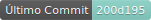

```
  █▀ █▀▀ █▄░█ ▀█▀ █░█  ┎┤  Ingeniería de Datos & Data Science  ├┒
  ▄█ ██▄ █░▀█ ░█░ █▄█  ┖┤              en Python               ├┚
              .studio
```

<div align="center"><p>
    <a href="https://github.com/SENTUstudio/dotfiles/releases/latest">
      
    </a>
    <a href="https://github.com/SENTUstudio/dotfiles/pulse">
      
    </a>
    <a href="https://github.com/SENTUstudio/dotfiles/blob/main/LICENSE">
      
    </a>
    <a href="https://github.com/SENTUstudio/dotfiles/stargazers">
      
    </a>
    <a href="https://github.com/SENTUstudio/dotfiles/issues">
      
    </a>
    <a href="https://github.com/SENTUstudio/dotfiles">
      
    </a>
  </p>
</div>

# dotfiles

Proyecto que se encarga de hacer una post-instalación a un sistema operativo resién instalado, donde instala las aplicaciones bases de mi preferencia y copia mis archivos de configuración al nuevo sistema. consta de un script llamado sentu_install.py que se usa por medio de curl para llamar a todo el proyecto en formato zip desde un repositorio, lo extrae y ejecuta la instalación mínima requerida para poder ejecutar las Fases de post-instalación.

Su funcionamiento es simple, con la instrucción de instalar (mencionada más abajo) se toma el script sentu_install.py desde el repositorio y se ejecuta, donde comprueba los requerimientos mínimos para su funcionamiento y si no los tiene los instala, luego clona el repositorio dotfiles y ejecuta Ansible para realizar la post-instalación de paquetes y enlaces de mis archivos config

Esta versión del proyecto respalda mis archivos de configuración para linux pensado primeramente y optimizado para la distro de linux Fedora, pero la idea es que sea multi-sistema, para incluir las distros más famosas de linux, mac y windows

## Estructura de Archviso del proyecto

El proyecto cuenta con una estructura personalizada adaptada para proyectos python

```bash
dotfiles
├── ansible
│   ├── playbook.yml
│   ├── roles
│   │   ├── add_repositories
│   │   │   └── tasks
│   │   │       └── main.yml
│   │   ├── base_system_configuration
│   │   │   └── tasks
│   │   │       └── main.yml
│   │   ├── dotfiles_management
│   │   │   └── tasks
│   │   │       └── main.yml
│   │   ├── install_core_dependencies
│   │   │   └── tasks
│   │   │       └── main.yml
│   │   ├── install_extended_dependencies
│   │   │   └── tasks
│   │   │       └── main.yml
│   │   ├── install_post_install
│   │   │   └── tasks
│   │   │       └── main.yml
│   │   ├── install_rye
│   │   │   └── tasks
│   │   │       └── main.yml
│   │   └── install_uv
│   │       └── tasks
│   │           └── main.yml
│   └── vars
│       └── installer_config.yaml
├── config
│   ├── alacritty
│   ├── bspwm
│   ├── fastfetch
│   ├── gh
│   ├── git
│   ├── kitty
│   ├── lazygit
│   ├── mpd
│   ├── ncmpcpp
│   ├── nvim
│   ├── ohmyposh
│   ├── paru
│   ├── ranger
│   ├── sentu
│   ├── tmux
│   ├── tmuxinator
│   └── zsh
├── home
│   ├── .p10k.zsh
│   └── .zshrc
├── README.md
└── sentu_install.py

```

Sistemas Operativos probados

- [x] Fedora KDE 41+

- [ ] OpenSUSE

# Instalación

```bash
curl -LsSf https://raw.githubusercontent.com/SENTUstudio/dotfiles/refs/heads/main/sentu_install.py | python3
```

# Diagrama de flujo


